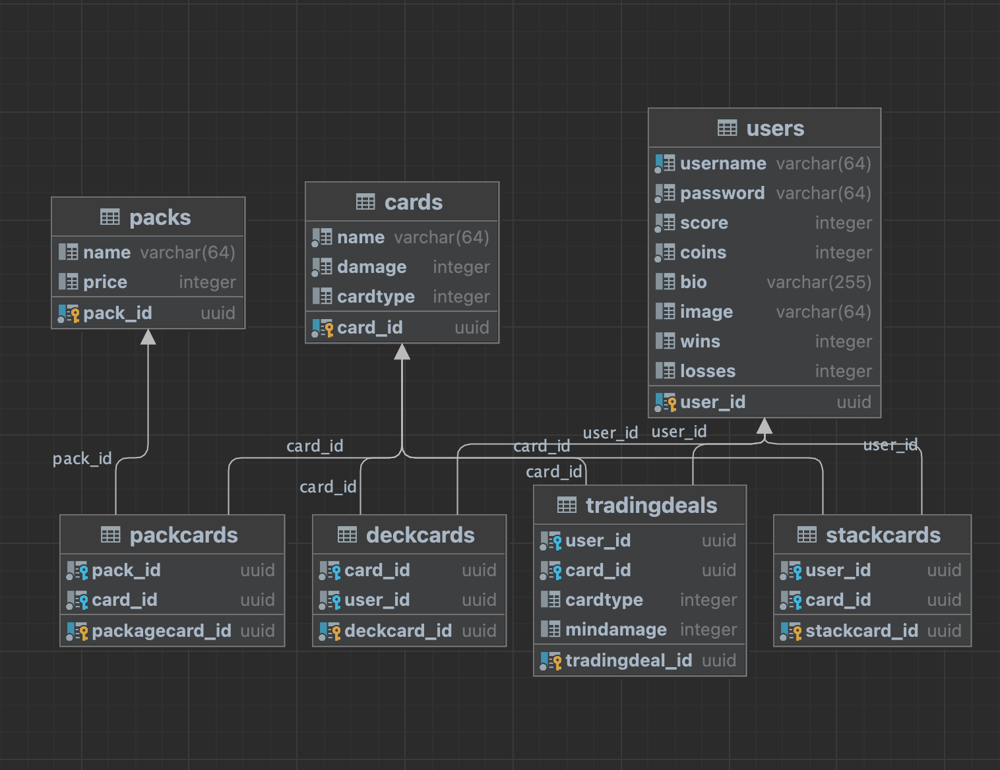

# MTCG

## Architecture / Design
Der Hauptteil des Projekts ist eine Spielverwaltung für das Monster Trading Cards Game.
Dieses Spiel ist in Form einer REST API implementiert und wir über den eigenen http server gehostet.

Der Server startet für jeden Request einen eigenen Thread mit Referenz zur Applikation.
Die Threads teilen somit die App, was die Interprozesskommunikation erleichtert.

Requests werden in der App an die jeweiligen Controller weitergeleitet.
- Session
- User
- Card
- Pack
- Trading
- Battle

Der Großteil der Requests bzw. Controller-Aufrufe wird von den Unit tests abgedeckt.

Die Business-Logik findet Hauptsächlich in Repositories statt. (Card, Pack, Trading, User)

Beim Battle, welches nicht direkt als Model in der Datenbank abgebildet ist, werden sämtliche Operationen direkt in der Klasse abgehandelt.

Datenbank operationen bzw. DML Queries werden über Data Access Objects bearbeitet.

### Database
Für die Datenspeicherung wird eine Postgres Datenbank angebunden.

## Unique Feature
Als unique Feature wurde ein Passwort reset für User implementiert. Passwörter werden zudem über die BCrypt library mit salt gehashed und somit "sicher" in der Datenbank gespeichert.

## Lessons learned
Das DAO / Repository design war für mich zu Beginn nicht klar zu durchschauen. Dennoch habe ich versucht es so gut wie möglich zu implementieren.

Für Datenbankaufrufe hätte ich lieber eine generische Klasse um die Menge and repetitiven codeblöcken zu reduzieren.

Die Struktur ist teilweise sehr verflochten, so brauchen manche Repositories (Trading, Pack) mehrere DAOs und manche Controller (Battle, Trading) brauchen verschiedene Repositories.

Vor allem zeitlich habe ich mich stark verkalkuliert. Die Anforderungen sind zwar funktional erfolgereich umgesetzt, jedoch würden sich viele Teile schöner lösen lassen.

Da ich mir zu Beginn des Projekts noch nicht klar vorstellen konnte wie die Lösung aussehen wird und erst während dem Entwickeln auf viele wichtige Punkte gestoßen bin, habe ich den Gesamten Aufbau mehrfach neu strukturiert.

## Git
https://github.com/synaxk/MTCG